# 仓库调度系统前端架构流程图

## 📋 文档概述

本文档详细展示了仓库调度系统的前端完整工作逻辑和执行流程，包括主程序入口、GUI 系统架构、事件处理机制、渲染流水线等核心组件的交互关系。

---

## 🚀 主程序执行流程 (test/main.cpp)

```mermaid
flowchart TD
    A[程序启动 main.cpp] --> B[解析命令行参数]
    B --> C{检查参数}
    C -->|无参数| D[默认模式: TASK1_DEFAULT_MODE]
    C -->|有参数| E[解析指定模式]

    D --> F_Group_Entry
    E --> F_Group_Entry
    F_Group_Entry[创建SimpleDemoApp实例] --> F_SubGraph

    subgraph F_SubGraph [SimpleDemoApp 构造与初始化]
        direction TB
        F_H[1. 初始化SFML窗口]
        F_I[2. 加载字体]
        F_J[3. 初始化并绑定核心后端组件<br>(Scheduler, TaskManager, etc.)]
        F_K[4. 创建GUI组件<br>(Toolbar, Panels, SimView等)]
        F_H --> F_I --> F_J --> F_K
    end

    F_SubGraph --> G[app.run 主循环启动]

    G --> G_L[主事件循环]
    G_L --> L[handleEvents 事件处理]
    L --> M[update 状态更新]
    M --> N[render 渲染绘制]
    N --> O{窗口是否关闭?}
    O -->|否| L
    O -->|是| P[清理资源并退出]

    style A fill:#e1f5fe
    style F_Group_Entry fill:#e6f7ff
    style F_SubGraph fill:#f0f4c3
    style G fill:#c8e6c9
    style G_L fill:#fff9c4
    style L fill:#fff3e0
    style M fill:#fff3e0
    style N fill:#fff3e0
    style P fill:#ffebee
```

---

## 🎨 前端 GUI 系统完整架构流程

### 1. 系统初始化流程

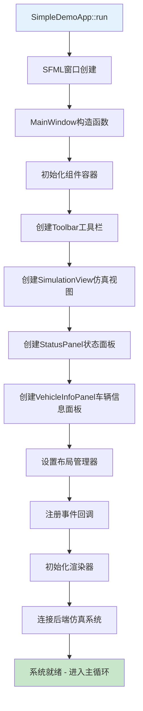

### 2. 主循环三阶段架构

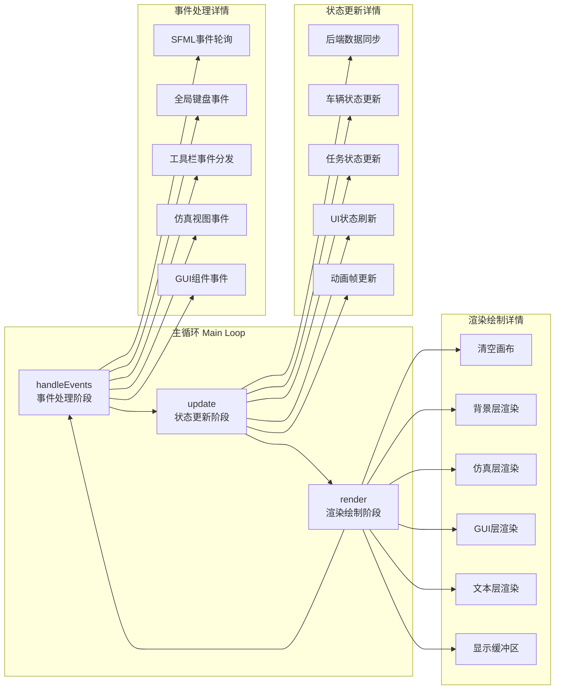

---

## 🎯 事件处理系统详细流程

### 分层事件处理机制

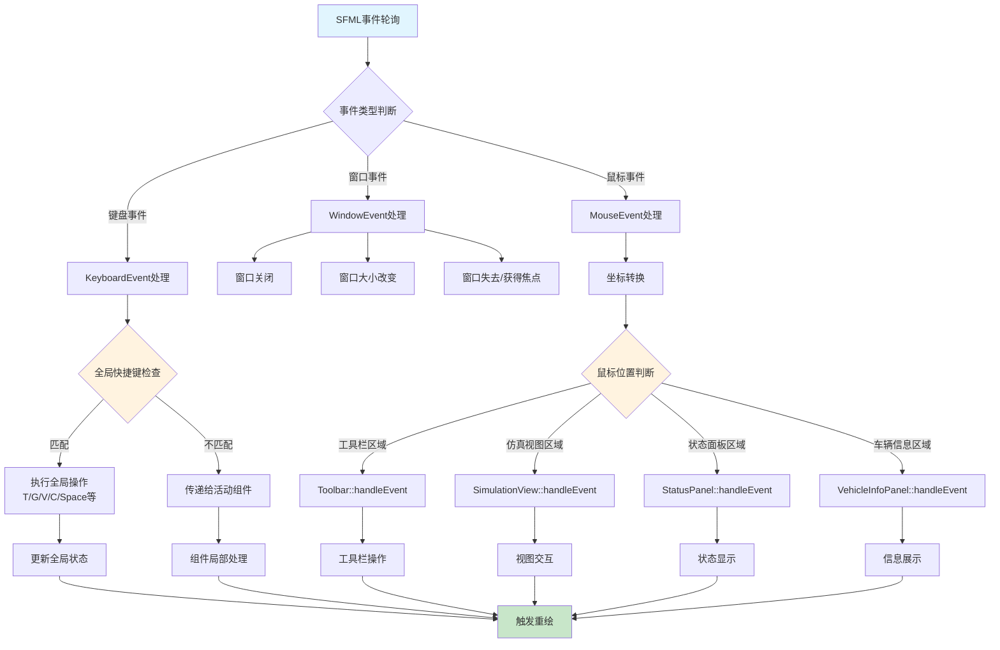

### 键盘事件优先级处理

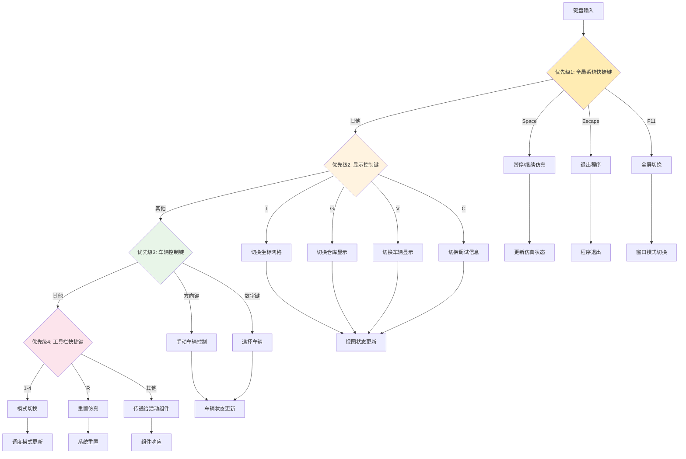

---

## 🎨 渲染系统多层架构

### 渲染流水线详细流程

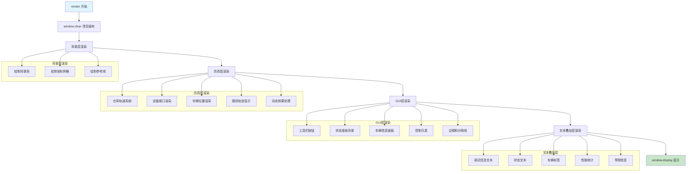

### 组件渲染调用层次

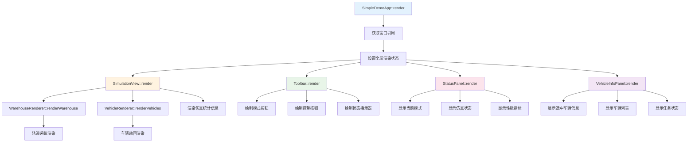

---

## 🔄 数据流和状态同步机制

### 前后端数据同步流程

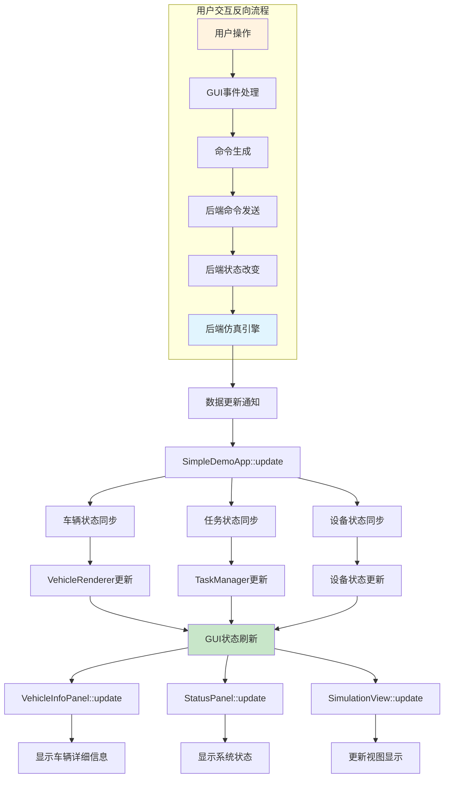

### 状态管理架构

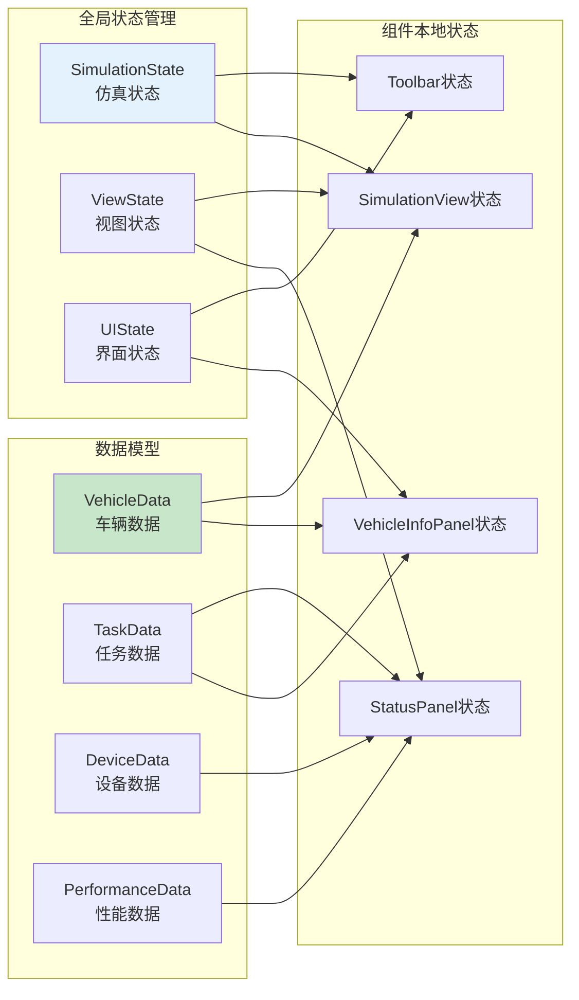

---

## 🏗️ 组件交互关系图

### GUI 组件层次结构

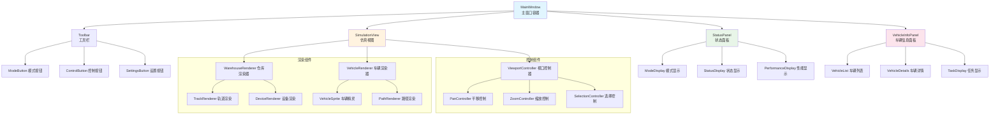

### 组件通信机制

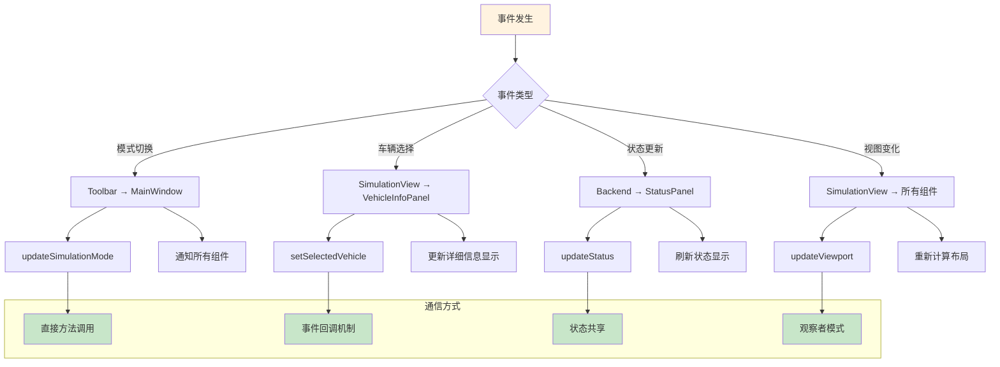

---

## 🔧 性能优化和渲染优化

### 渲染性能优化策略

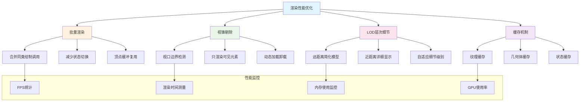

---

## 📊 调试和开发工具集成

### 调试信息显示系统

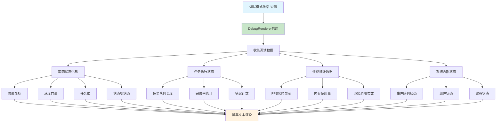

---

## 📈 总体架构总结

### 系统架构层次图

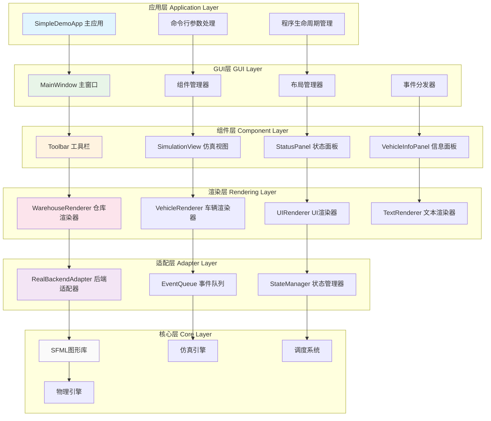

---

## 🎯 关键技术特性

### 1. **模块化设计**

- 清晰的组件边界和职责分离
- 可插拔的渲染器和适配器
- 统一的事件处理接口

### 2. **高性能渲染**

- 多层渲染流水线
- 批量绘制优化
- 视锥剔除和 LOD

### 3. **实时交互**

- 分层事件处理系统
- 优先级驱动的输入响应
- 流畅的用户交互体验

### 4. **可扩展架构**

- 适配器模式连接前后端
- 组件化的 GUI 系统
- 灵活的状态管理机制

---

## 📝 开发和维护说明

### 添加新 GUI 组件的流程

1. 继承基础组件类
2. 实现 handleEvent、update、render 方法
3. 在 MainWindow 中注册和布局
4. 配置事件路由和状态同步

### 性能调优指南

1. 使用性能分析工具监控渲染性能
2. 优化绘制调用批次
3. 实施合适的缓存策略
4. 根据需要调整渲染精度

### 调试技巧

1. 使用'C'键开启调试模式
2. 检查控制台输出的详细日志
3. 监控事件处理链路
4. 分析状态同步时序

---

_文档创建时间: 2025 年 6 月 7 日_  
_基于项目版本: Warehouse-sch v1.0_  
_架构分析: 前端 GUI 系统完整流程_
