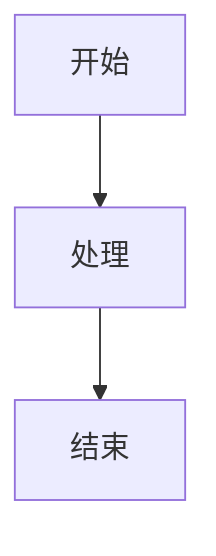
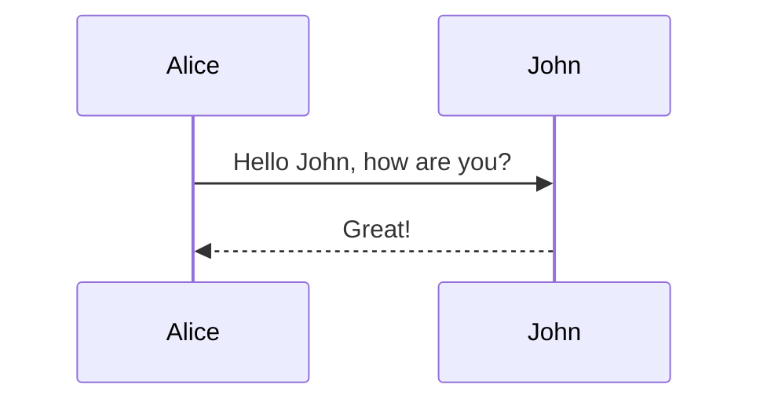

# Mermaid to PNG 转换器

这是一个用于从Markdown文件中提取Mermaid图表并转换为PNG图片的Python工具。该工具使用纯Python标准库开发，无需安装额外依赖，支持中文内容。

## 功能特性

- 🔍 自动扫描.md文件中的Mermaid代码块
- 🌐 使用Kroki API在线转换图表（支持中文）
- 📁 自动创建专门的图片文件夹保存PNG图片
- 🏷️ 智能文件命名（基于图表类型和序号）
- 🔄 支持批量处理多个文件
- ⚡ 内置请求限制和错误处理
- 🚀 零依赖，仅使用Python标准库

## 安装依赖

**无需安装任何依赖！** 本工具仅使用Python标准库，直接运行即可。

```bash
# 直接使用，无需安装依赖
python mermaid_to_png.py
```

## 使用方法

### 基本用法

```bash
# 处理当前目录下的所有.md文件
python mermaid_to_png.py

# 处理指定目录
python mermaid_to_png.py -d /path/to/directory

# 处理单个文件
python mermaid_to_png.py -f your_file.md

# 指定输出目录
python mermaid_to_png.py -o output_directory
```

### 参数说明

- `-d, --directory`: 要处理的目录路径（默认：当前目录）
- `-f, --file`: 要处理的单个Markdown文件
- `-o, --output`: 输出目录（默认：与源文件同级目录）

## 支持的Mermaid图表类型

- 🔄 流程图 (Flowchart)
- 📈 序列图 (Sequence Diagram)
- 📊 甘特图 (Gantt Chart)
- 🥧 饼图 (Pie Chart)
- 🗺️ 用户旅程图 (User Journey)
- 🌳 Git图 (Git Graph)
- 📋 其他图表类型

## 文件夹结构

转换后的PNG图片将保存在专门的文件夹中：

```
your_markdown_file.md
your_markdown_file_mermaid_images/
    ├── your_markdown_file_flowchart_01.png
    ├── your_markdown_file_sequence_02.png
    ├── your_markdown_file_diagram_03.png
    └── ...
```

## 输出文件命名规则

生成的PNG文件将按以下规则命名：
```
{原文件名}_{图表类型}_{序号}.png
```

专门的图片文件夹命名规则：
```
{原文件名}_mermaid_images/
```

例如：
- `Frontend_Architecture_Flowchart_mermaid_images/`
  - `Frontend_Architecture_Flowchart_flowchart_01.png`
  - `Frontend_Architecture_Flowchart_flowchart_02.png`
  - `Frontend_Architecture_Flowchart_sequence_03.png`

## 示例

假设您有一个包含Mermaid图表的Markdown文件 `example.md`：

````markdown
# 我的文档

这是一个流程图：



这是一个序列图：


````

运行转换器后，将在同级目录下生成：
```
example_mermaid_images/
    ├── example_flowchart_01.png
    └── example_sequence_02.png
```

## 注意事项

1. **网络连接**: 需要稳定的网络连接访问Kroki API (kroki.io)
2. **API限制**: 内置了请求延时以避免API限制
3. **文件编码**: 支持UTF-8编码的Markdown文件
4. **中文支持**: 使用Kroki API，完美支持中文内容
5. **图表复杂度**: 支持所有Mermaid图表类型

## 技术说明

- **API服务**: 使用 Kroki.io 提供的免费在线转换服务
- **网络请求**: 使用Python标准库 `urllib.request`
- **文件操作**: 使用Python标准库 `pathlib` 和 `os`
- **正则匹配**: 使用 `re` 模块提取Mermaid代码块

## 错误处理

- ✅ 网络连接异常自动重试
- 📝 详细的错误日志和进度显示
- 🔄 跳过失败的图表继续处理其他图表
- 📊 处理完成后显示成功率统计
- 🛡️ 文件路径和编码问题自动处理

## 项目结构

```
MermaidToPng_py/
├── mermaid_to_png.py              # 主脚本文件
├── README.md                      # 项目说明文档
├── requirements.txt               # 依赖文件（实际无需安装）
├── Frontend_Architecture_Flowchart.md  # 示例测试文件
└── Frontend_Architecture_Flowchart_mermaid_images/  # 生成的图片文件夹
    ├── Frontend_Architecture_Flowchart_flowchart_01.png
    ├── Frontend_Architecture_Flowchart_flowchart_02.png
    └── ...
```

## 开发信息

- **作者**: GitHub Copilot  
- **版本**: 2.0.0  
- **创建日期**: 2025-06-08  
- **Python版本**: 3.6+  
- **许可证**: MIT  
- **API服务**: [Kroki.io](https://kroki.io)

## 更新日志

### v2.0.0 (2025-06-08)
- ✨ 使用纯Python标准库，零依赖
- 🔧 切换到Kroki API，完美支持中文
- 📁 自动创建专门的图片文件夹
- 🏷️ 优化文件命名规则
- 🐛 修复多个已知问题

### v1.0.0 (2025-06-08)
- 🎉 初始版本发布
- 🔍 基本的Mermaid代码块提取功能
- 🌐 使用mermaid.ink API转换
