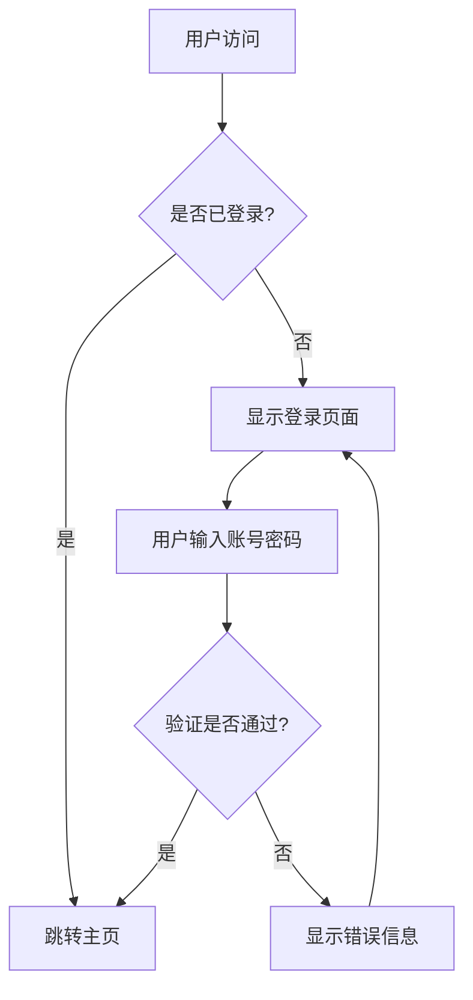
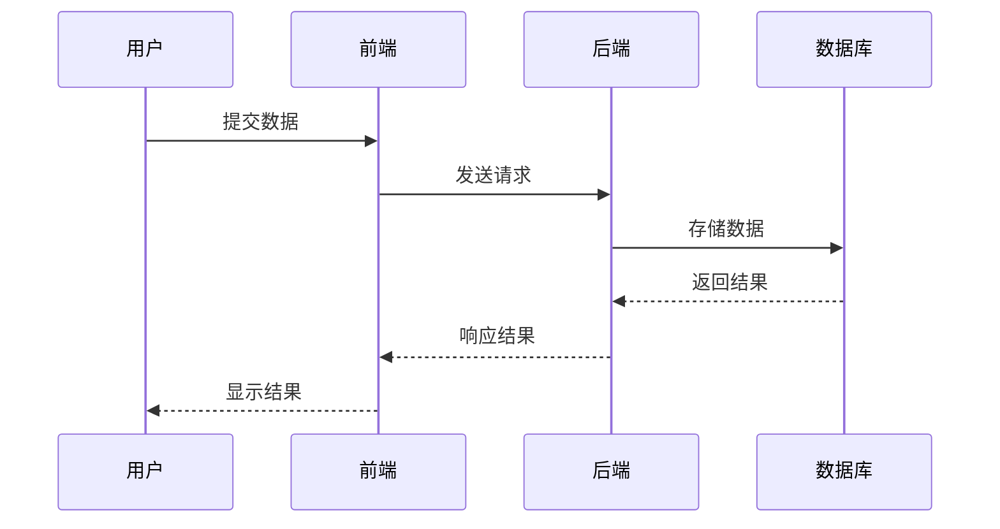
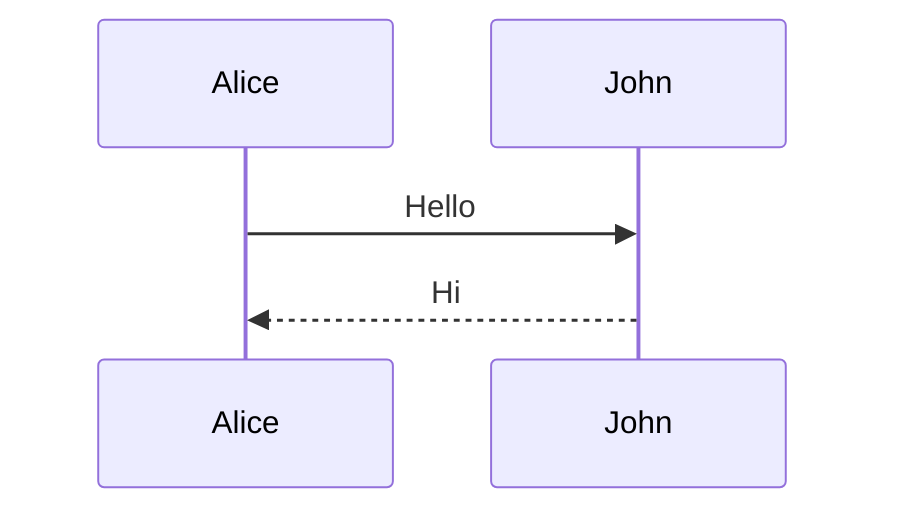
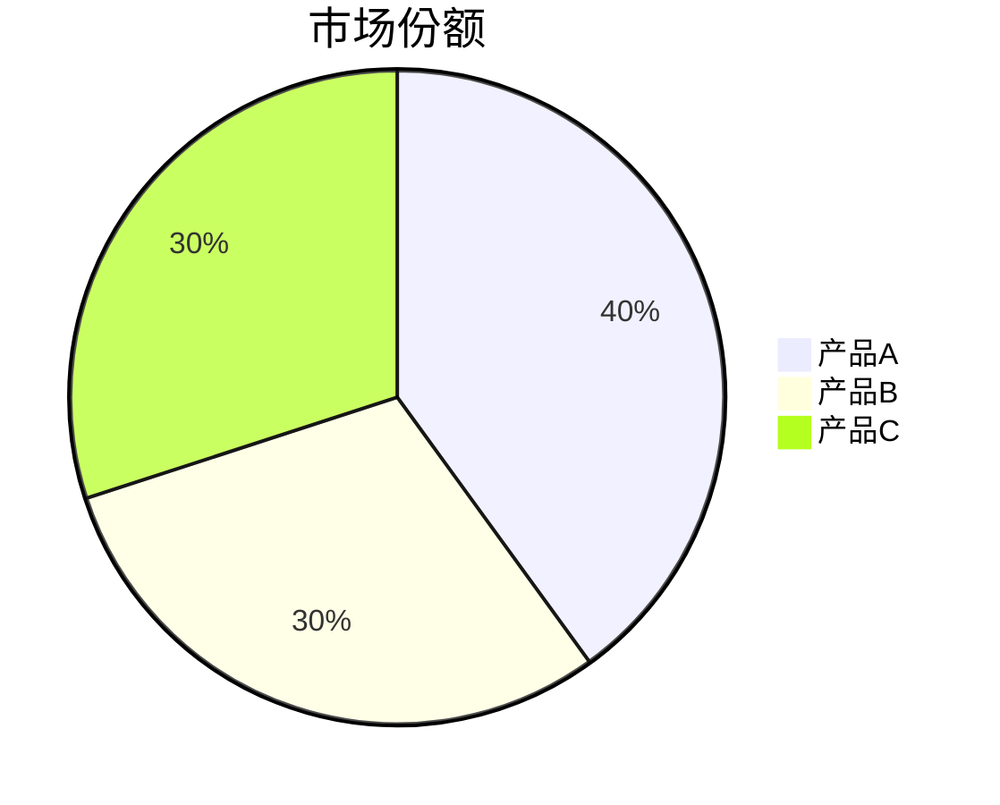

# 使用示例

本文档提供了 Mermaid to PNG 转换器的详细使用示例。

## 快速开始

### 1. 基本使用 - 处理当前目录

```bash
python mermaid_to_png.py
```

这将扫描当前目录下所有的 `.md` 文件并转换其中的 Mermaid 图表。

### 2. 处理指定目录

```bash
python mermaid_to_png.py -d /path/to/your/docs
```

### 3. 处理单个文件

```bash
python mermaid_to_png.py -f your_document.md
```

### 4. 指定输出目录

```bash
python mermaid_to_png.py -o output_images
```

## 实际示例

### 示例 1: 处理项目文档

假设您有一个项目文档目录：

```
project_docs/
├── architecture.md
├── workflow.md
└── api_design.md
```

运行命令：
```bash
python mermaid_to_png.py -d project_docs
```

结果：
```
project_docs/
├── architecture.md
├── architecture_mermaid_images/
│   ├── architecture_flowchart_01.png
│   └── architecture_sequence_02.png
├── workflow.md
├── workflow_mermaid_images/
│   └── workflow_flowchart_01.png
├── api_design.md
└── api_design_mermaid_images/
    ├── api_design_sequence_01.png
    └── api_design_class_02.png
```

### 示例 2: 处理包含中文的 Markdown 文件

文件 `chinese_doc.md` 内容：

````markdown
# 系统架构文档

## 用户登录流程



## 数据处理流程


````

运行：
```bash
python mermaid_to_png.py -f chinese_doc.md
```

生成：
```
chinese_doc_mermaid_images/
├── chinese_doc_flowchart_01.png
└── chinese_doc_sequence_02.png
```

### 示例 3: 批量处理多种图表类型

文件 `comprehensive_doc.md` 包含多种图表：

````markdown
# 综合图表示例

## 流程图


## 序列图


## 甘特图


## 饼图

````

运行后生成：
```
comprehensive_doc_mermaid_images/
├── comprehensive_doc_flowchart_01.png
├── comprehensive_doc_sequence_02.png
├── comprehensive_doc_gantt_03.png
└── comprehensive_doc_pie_04.png
```

## 高级用法

### 自定义输出目录结构

```bash
# 所有图片统一保存到 images 目录
python mermaid_to_png.py -d docs -o images

# 结果：所有PNG文件都保存在 images/ 目录下
```

### 处理大批量文件

```bash
# 处理整个文档网站
python mermaid_to_png.py -d website/docs

# 只处理特定模式的文件（需要先筛选）
find . -name "*.md" -path "*/design/*" | while read file; do
    python mermaid_to_png.py -f "$file"
done
```

## 错误处理示例

### 常见错误和解决方案

1. **网络连接问题**
   ```
   ❌ 网络请求失败: HTTPSConnectionPool(host='kroki.io', port=443)
   ```
   解决：检查网络连接，等待网络恢复后重试。

2. **图表语法错误**
   ```
   ❌ API请求失败: 400 - Bad Request
   ```
   解决：检查 Mermaid 语法是否正确。

3. **文件权限问题**
   ```
   ❌ 保存图片失败: [Errno 13] Permission denied
   ```
   解决：检查目录写入权限。

## 性能说明

- 每个图表转换约需要 1-3 秒（取决于网络和图表复杂度）
- 内置延时机制避免 API 限制
- 支持断点续传（跳过失败的图表继续处理其他图表）

## 支持的图表类型

| 图表类型 | Mermaid 语法 | 生成文件名模式 |
|---------|-------------|---------------|
| 流程图 | `flowchart` / `graph` | `*_flowchart_*.png` |
| 序列图 | `sequenceDiagram` | `*_sequence_*.png` |
| 甘特图 | `gantt` | `*_gantt_*.png` |
| 饼图 | `pie` | `*_pie_*.png` |
| 类图 | `classDiagram` | `*_class_*.png` |
| 状态图 | `stateDiagram` | `*_state_*.png` |
| 用户旅程图 | `journey` | `*_journey_*.png` |
| Git图 | `gitgraph` | `*_gitgraph_*.png` |
| 其他 | 其他类型 | `*_diagram_*.png` |
